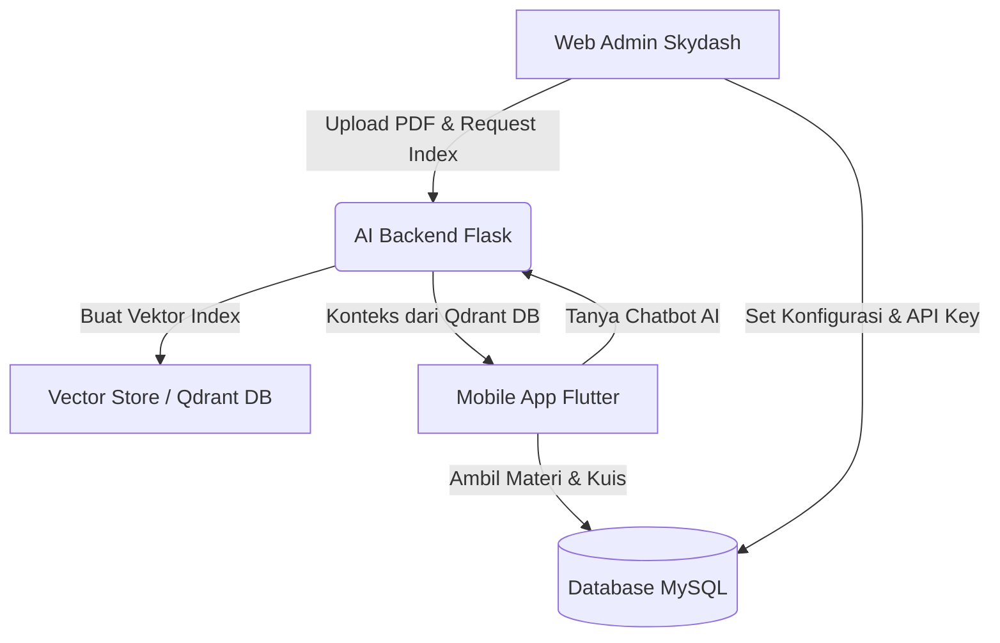
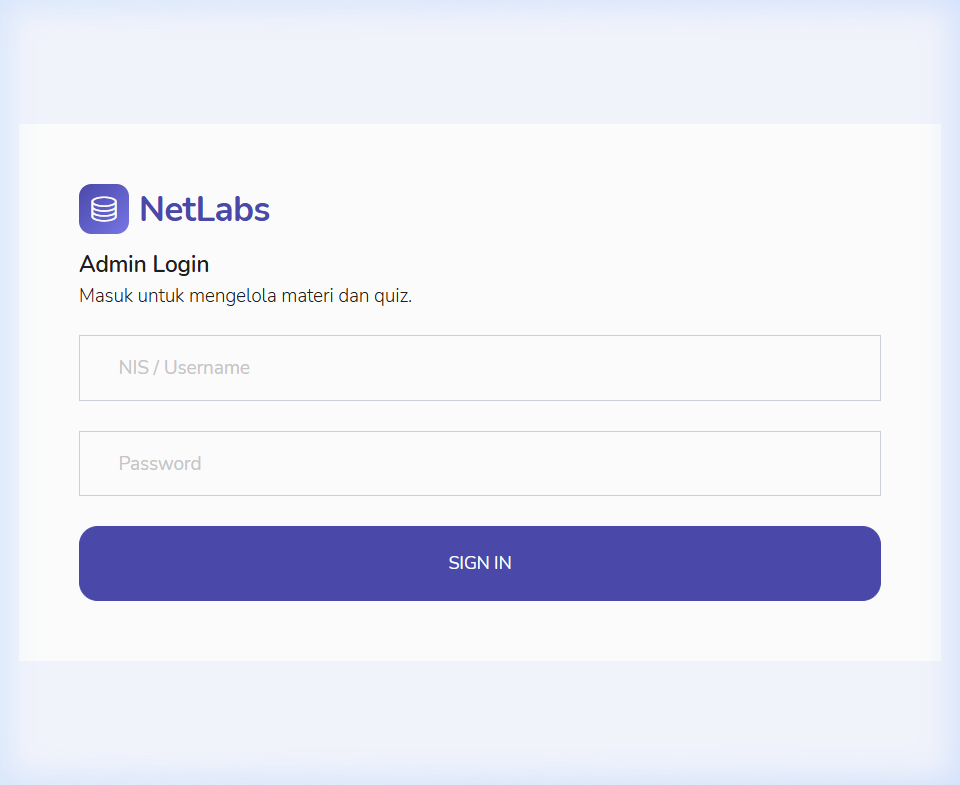
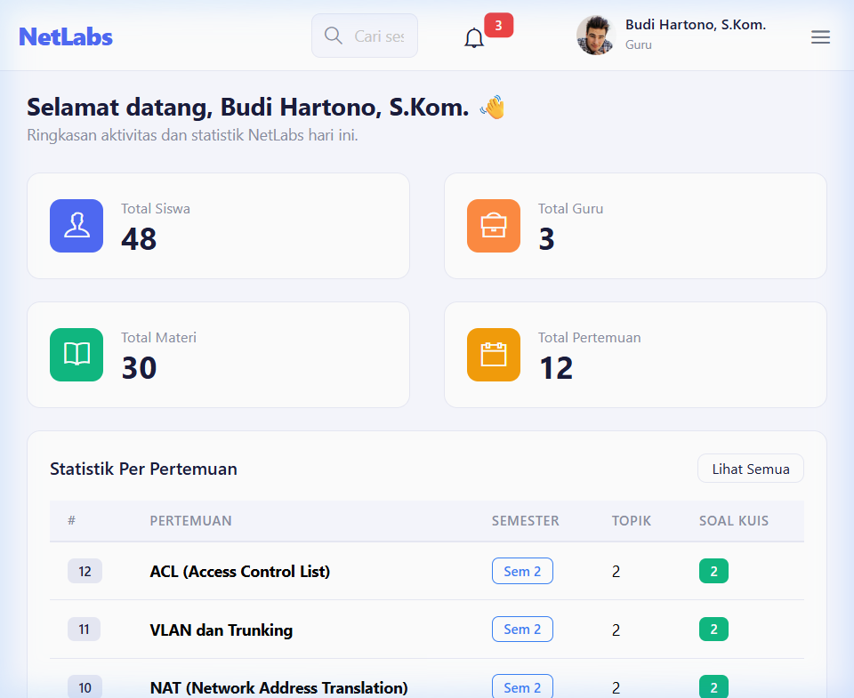
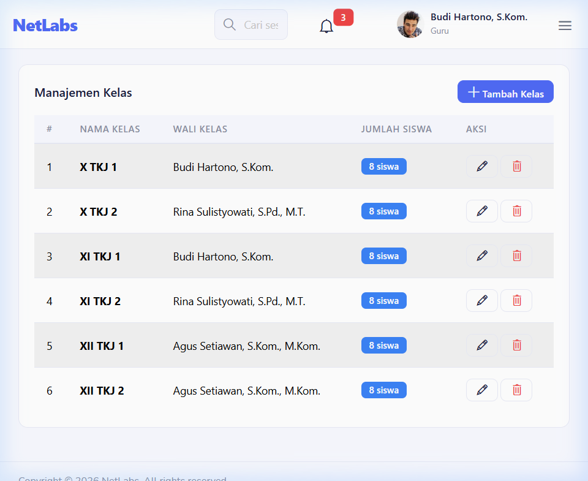
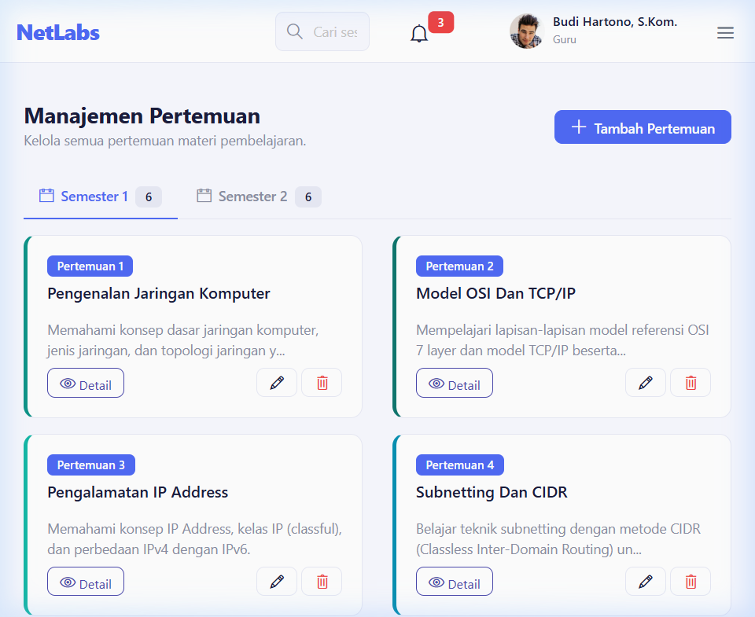
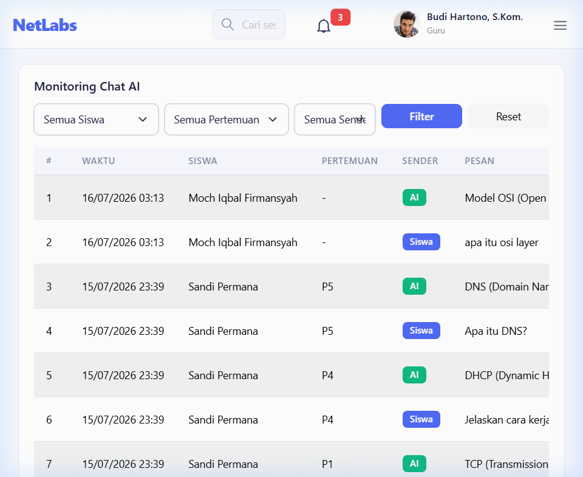

# BUKU PANDUAN PENGGUNAAN (MANUAL BOOK)
## Sistem Manajemen Pembelajaran & AI RAG "NetLabs"

Buku panduan ini disusun sebagai pedoman operasional untuk administrator, pengajar (guru), dan pengembang dalam mengelola platform **NetLabs** (Web Admin Laravel 12 Skydash Template + Mobile App Flutter).

---

## 1. Arsitektur & Alur Kerja Sistem

Sistem NetLabs terdiri dari tiga komponen utama yang saling terintegrasi:
1.  **Web Admin (Laravel 12 + Skydash Template)**: Panel manajemen data untuk guru/administrator.
2.  **AI Backend (Python / Flask)**: Mesin pintar (port `5050`) untuk ekstraksi PDF, indexing berkas ke Vector Database (RAG), serta pembuatan soal kuis otomatis.
3.  **Mobile App (Flutter)**: Aplikasi pembelajaran untuk siswa (membaca materi, mengerjakan kuis, dan interaksi chatbot AI).



---

## 2. Panduan Operasional Web Admin (Laravel Skydash)

### A. Halaman Login Admin
*   **Tampilan/Screen**: Halaman login formal minimalis dengan tema Deep Indigo khas Skydash Template.
*   **Fungsi**: Membatasi hak akses pengelolaan agar hanya guru atau administrator sekolah yang dapat login ke dashboard.
*   **Gambar UI**:
    
*   **Cara Penggunaan**:
    1.  Buka browser dan akses URL panel admin (contoh: `https://netlabs.web.id/admin/login`).
    2.  Masukkan **Username** dan **Password** guru/admin Anda (misalnya username: `19950812001`, password: `guru123`).
    3.  Klik tombol **Sign In** untuk masuk ke sistem.

### B. Halaman Dashboard Admin
*   **Tampilan/Screen**: Widget statistik data, panel sambutan hangat guru, serta visualisasi grafik status pembelajaran.
*   **Fungsi**: Menyajikan ringkasan eksekutif seluruh data penting sistem secara real-time.
*   **Gambar UI**:
    
*   **Cara Penggunaan**:
    *   Tinjau widget jumlah **Siswa Terdaftar**, **Total Kelas**, **Modul Pertemuan**, dan **Riwayat Kuis**.
    *   Lihat status aktivitas terbaru untuk memantau keaktifan siswa.

### C. Halaman Manajemen Kelas
*   **Tampilan/Screen**: Tabel daftar kelas yang terdaftar beserta wali kelasnya.
*   **Fungsi**: Mengelompokkan siswa berdasarkan rombongan belajar (rombel) masing-masing.
*   **Gambar UI**:
    
*   **Cara Penggunaan**:
    1.  Klik menu **Manajemen Kelas** pada sidebar.
    2.  Untuk menambah kelas: Klik **Tambah Kelas**, masukkan nama kelas (misal: *XI TKJ 1*) dan tentukan guru pengampu/wali kelas, lalu klik **Simpan**.
    3.  Untuk mengedit/menghapus: Gunakan tombol aksi edit pensil atau hapus tong sampah di ujung kanan baris tabel.

### D. Halaman Manajemen Siswa
*   **Tampilan/Screen**: Tabel daftar akun siswa beserta form tambah/edit akun.
*   **Fungsi**: Mengelola kredensial masuk siswa untuk aplikasi mobile NetLabs.
*   **Cara Penggunaan**:
    1.  Klik menu **Manajemen Siswa** pada sidebar.
    2.  Klik **Tambah Siswa**, isi data lengkap mulai dari NIS (Nomor Induk Siswa), Nama Lengkap, Username, Kelas, dan Password.
    3.  Klik **Simpan**. Guru juga dapat meriset password siswa jika siswa lupa melalui form Edit Siswa.

### E. Halaman Modul Pertemuan & Integrasi AI (RAG)
*   **Tampilan/Screen**: Detail Pertemuan yang terbagi ke dalam sub-tab relasi data: *Topik Materi*, *Modul PDF RAG*, dan *Soal Kuis*.
*   **Fungsi**: Jantung dari penyediaan materi pembelajaran jaringan komputer berbasis AI.
*   **Gambar UI**:
    
*   **Cara Penggunaan**:
    1.  Pilih menu **Modul Pertemuan** -> klik **Tambah Pertemuan**.
    2.  Isi nomor urut bab, judul materi praktikum jaringan, deskripsi singkat, semester (1 atau 2), serta kode warna tema kartu (misal: `#3B82F6` untuk warna biru) untuk UI kartu di aplikasi mobile siswa.
    3.  Klik **Simpan**. Setelah itu, masuk ke halaman detail modul pertemuan untuk mengelola 3 komponen berikut:
        *   **Topik Materi (Rich Text)**:
            *   Tambahkan sub-bab atau materi bacaan mandiri langsung ke editor teks, lalu klik simpan agar teks tersebut tampil di layar aplikasi mobile siswa.
        *   **Modul PDF RAG (Dokumen AI)**:
            *   Unggah berkas modul praktikum resmi berformat `.pdf` (ukuran maks 20MB).
            *   Setelah diunggah, klik tombol **"Index AI"** untuk mengirim modul ke Flask AI Backend.
            *   Status indexing akan berubah: `Pending` -> `Success` / `Failed`. Setelah berstatus `Success`, siswa secara instan dapat menanyakan materi di dalam dokumen PDF tersebut kepada AI Tutor.
        *   **Bank Soal Kuis (Otomatis & Manual)**:
            *   **Manual**: Masukkan soal, opsi pilihan ganda A/B/C/D, kunci jawaban, dan penjelasan/pembahasan.
            *   **Otomatis (Generative AI)**: Masukkan jumlah soal yang diinginkan (1-20), klik tombol **"Generate Soal AI"**. Sistem akan menghubungi Flask AI Backend untuk membaca dokumen PDF modul yang telah sukses di-index dan membuat soal pilihan ganda beserta pembahasannya secara cerdas sesuai kurikulum.

### F. Halaman Monitoring Chat AI
*   **Tampilan/Screen**: Tabel log percakapan siswa dengan AI Tutor.
*   **Fungsi**: Memantau topik pertanyaan siswa serta mengawasi kualitas jawaban AI Tutor.
*   **Gambar UI**:
    
*   **Cara Penggunaan**:
    1.  Klik menu **Riwayat Chat AI** pada sidebar.
    2.  Gunakan filter pencarian berdasarkan **Nama Siswa**, **Modul Pertemuan**, atau **Pengirim** (Siswa vs AI).
    3.  Guru dapat menghapus log riwayat obrolan siswa tertentu jika diperlukan menggunakan tombol **Hapus**.

### G. Halaman Pengaturan (Settings)
*   **Tampilan/Screen**: Form konfigurasi parameter sistem dan sekolah.
*   **Fungsi**: Menyesuaikan variabel global aplikasi secara dinamis tanpa perlu mengubah baris kode langsung.
*   **Cara Penggunaan**:
    1.  Klik menu **Pengaturan** pada sidebar.
    2.  Sesuaikan data berikut:
        *   **Nama Aplikasi**: `NetLabs`
        *   **Nama Sekolah**: Nama SMK Anda (misal: *SMK Negeri 1 Jakarta*)
        *   **Alamat & Kontak Sekolah**: Info detail sekolah.
        *   **AI Service URL**: Alamat URL host Flask AI Backend (default: `http://127.0.0.1:5050`).
        *   **AI API Key**: Masukkan Google Gemini API Key aktif Anda untuk mengaktifkan RAG dan Generator Kuis.
        *   **Google Form URL**: URL kuisioner kepuasan/umpan balik sistem.
    3.  Klik **Simpan Pengaturan**. Sistem akan otomatis memperbarui file konfigurasi `.env` dan membersihkan cache konfigurasi Laravel.

---

## 3. Panduan Fitur Aplikasi Mobile (Siswa)

### A. Layar Onboarding (`onboarding_view.dart`)
*   **Deskripsi**: Layar pengenalan pertama kali saat aplikasi dibuka setelah diinstal.
*   **Elemen UI**: Ilustrasi modern, judul edukatif, dan deskripsi ringkas mengenai fitur AI Tutor RAG, kuis evaluasi jaringan, serta pelacakan progres belajar.
*   **Fungsi**: Membimbing siswa baru memahami alur penggunaan NetLabs.

### B. Layar Utama / Beranda (`home_view.dart`)
*   **Deskripsi**: Pusat dashboard siswa setelah berhasil login.
*   **Elemen UI**:
    *   *Header*: Menyapa nama siswa beserta rombel kelasnya.
    *   *Stat Cards*: Kartu statistik ringkas yang menampilkan rata-rata nilai kuis, jumlah bab modul yang telah diselesaikan, dan frekuensi interaksi dengan AI.
    *   *Bento Grid Modul*: Daftar bab modul pertemuan semester berjalan yang disajikan dengan warna tema kustom yang telah diatur oleh guru dari panel admin.
    *   *Rekomendasi / Tips AI*: Info harian menarik tentang jaringan komputer yang di-generate dinamis.
*   **Fungsi**: Menyediakan navigasi cepat ke materi yang belum selesai dibaca dan melihat perkembangan belajar mandiri.

### C. Layar Daftar Modul (`materi_view.dart`)
*   **Deskripsi**: Katalog seluruh bab modul pertemuan yang terbagi rapi.
*   **Elemen UI**:
    *   *Tabs*: Mengelompokkan modul berdasarkan **Semester 1** dan **Semester 2**.
    *   *List Modul*: Setiap modul memiliki status progres membaca berupa persentase kelengkapan (*Progress Bar*) dan tanda centang hijau bila selesai dibaca.

### D. Layar Detail Bacaan (`detail_materi_view.dart`)
*   **Deskripsi**: Layar utama membaca topik bahasan secara terperinci.
*   **Elemen UI**: Tampilan teks materi pelajaran yang di-render dari editor teks guru, tombol navigasi sub-bab, serta tombol **Tanya AI** di bagian bawah untuk langsung beralih ke Chatbot AI yang berfokus pada bab modul ini.

### E. Layar Evaluasi Kuis (`quiz_view.dart`)
*   **Deskripsi**: Media pengerjaan latihan kuis interaktif.
*   **Elemen UI**:
    *   *Header*: Progress pengerjaan soal (contoh: *Soal ke-3 dari 5*).
    *   *Pilihan Ganda*: Aksi ketuk (*tap*) yang responsif pada salah satu pilihan A, B, C, atau D.
    *   *Layar Skor Akhir*: Tampilan total skor kelulusan. Jika skor berada di bawah KKM sekolah, status kelulusan kuis akan berwarna merah (Tidak Lulus).
    *   *Rekomendasi Belajar AI*: Analisis rekomendasi pintar dari AI yang merujuk bagian modul mana saja yang salah dijawab, agar siswa dapat mempelajari kembali sub-bab materi tersebut.

### F. Layar AI Tutor Chatbot (`chatbot_view.dart`)
*   **Deskripsi**: Asisten belajar interaktif 24/7 menggunakan kecerdasan buatan RAG.
*   **Elemen UI**:
    *   *Chat Bubble*: Percakapan bergaya modern dengan balon chat siswa (warna indigo) dan balon chat AI (warna putih/abu-abu).
    *   *Suggestion Chips*: Kueri pertanyaan siap pakai di bagian bawah (contoh: *"Apa perbedaan router dan switch?"*).
    *   *Citation*: Penyebutan nama file sumber dokumen PDF yang di-index di panel admin sebagai dasar jawaban AI, menjamin keakuratan jawaban akademik.
    *   *Perekam Audio (TTS/STT)*: Tombol mikrofon untuk mengajukan kueri via suara dan fitur membaca teks jawaban AI dengan suara.

### G. Layar Profil Siswa (`profile_view.dart`)
*   **Deskripsi**: Layar pengaturan akun personal siswa.
*   **Elemen UI**: Foto profil siswa yang dapat diunggah baru, detail data siswa (NIS, Nama, Kelas), statistik ringkas, dan tombol logout.

---

## 4. Panduan Pemeliharaan Teknis (Maintenance)

### A. Membersihkan Cache Laravel
Jika konfigurasi `.env` telah diperbarui dari halaman Pengaturan tetapi tidak langsung diterapkan, jalankan perintah berikut pada terminal direktori `backend-web`:
```bash
php artisan config:clear
php artisan cache:clear
php artisan view:clear
```

### B. Memantau Log Eror
Apabila web admin atau aplikasi mobile tidak dapat terhubung ke AI Backend (misalnya saat upload PDF gagal di-index):
1.  Periksa apakah service Flask AI aktif pada port `5050`.
2.  Periksa file log kesalahan Laravel:
    `tail -n 50 storage/logs/laravel.log`
3.  Periksa log Flask AI yang biasanya berjalan menggunakan systemd service di server VPS:
    `journalctl -u netlabs-ai.service -n 50 -f`

> [!IMPORTANT]
> **Catatan Pengembang**: Pastikan *service* python AI Backend pada VPS (port 5050) selalu aktif (*running*) agar fitur **Index AI**, **Generate Soal**, dan **Chatbot** di aplikasi mobile dapat melayani *request* siswa tanpa hambatan.
