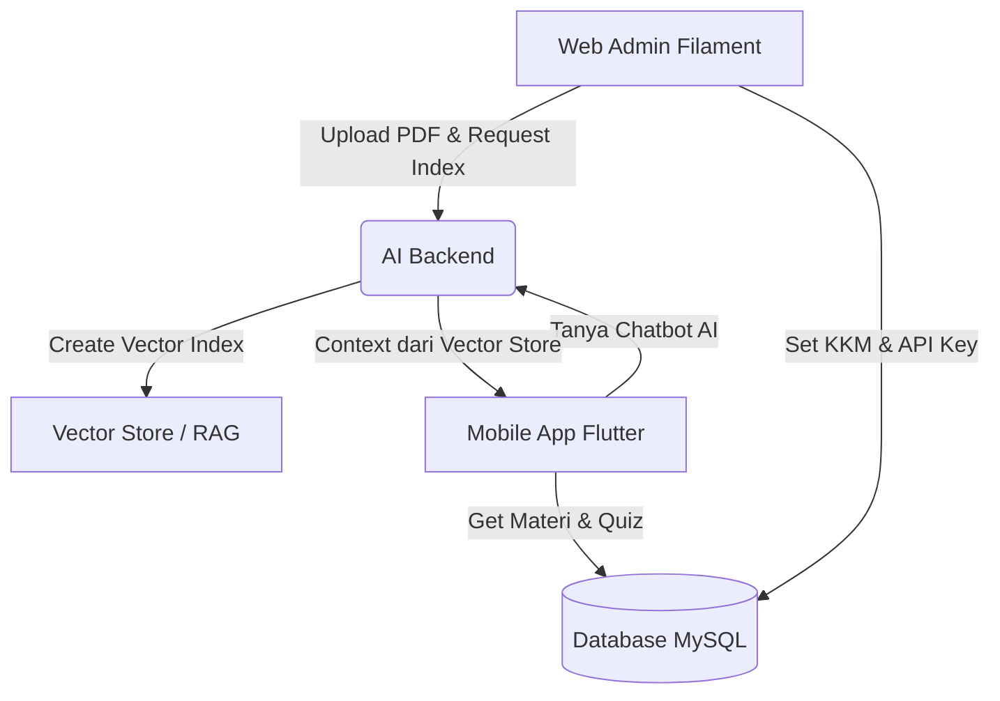

# BUKU PANDUAN PENGGUNAAN (MANUAL BOOK)
## Sistem Manajemen Pembelajaran & AI RAG "NetLabs"

Buku panduan ini disusun sebagai pedoman operasional untuk administrator, pengajar (guru), dan pengembang dalam mengelola platform **NetLabs** (Web Admin Filament v3 + Mobile App Flutter).

---

## 1. Arsitektur & Alur Kerja Sistem

Sistem NetLabs terdiri dari tiga komponen utama yang saling terintegrasi:
1.  **Web Admin (Laravel 11 + Filament v3)**: Panel manajemen data untuk guru/administrator.
2.  **AI Backend (Python / Flask-FastAPI)**: Mesin pintar (port `5000`/`5050`) untuk ekstraksi PDF, indexing berkas ke Vector Database (RAG), serta pembuatan soal otomatis.
3.  **Mobile App (Flutter)**: Aplikasi pembelajaran untuk siswa (membaca materi, mengerjakan kuis, dan interaksi chatbot AI).



---

## 2. Panduan Operasional Web Admin (Filament)

### A. Halaman Login Admin
*   **Tampilan/Screen**: Form login minimalis dengan tema Deep Indigo.
*   **Fungsi**: Membatasi hak akses pengelolaan agar hanya guru atau admin yang berhak melakukan konfigurasi.
*   **Cara Penggunaan**: Masukkan NIP/Username dan password, lalu klik *Sign In*.

### B. Halaman Dashboard Admin
*   **Tampilan/Screen**: Widget statistik ringkas dan grafik overview data kelas.
*   **Fungsi**: Memberikan gambaran cepat jumlah modul, total kelas terdaftar, dan jumlah kuis yang telah dievaluasi.
*   **Cara Penggunaan**: Memantau ringkasan data pembelajaran secara berkala.

### C. Halaman Manajemen Kelas
*   **Tampilan/Screen**: Tabel data kelas dan form input tambah/edit kelas.
*   **Fungsi**: Digunakan untuk mengelompokkan siswa dan menunjuk Wali Kelas.
*   **Cara Penggunaan**:
    1.  Buka menu **Manajemen Kelas** di sidebar.
    2.  Klik tombol **Tambah Kelas** (atau edit kelas yang ada).
    3.  Isi **Nama Kelas** (contoh: *XI TKJ 1*) dan pilih **Wali Kelas** dari daftar guru.
    4.  Gunakan tab **Kelola Siswa** di dalam detail kelas untuk memantau atau menambahkan akun siswa baru.

### D. Halaman Modul Pertemuan & Integrasi AI (RAG)
*   **Tampilan/Screen**: Detail Pertemuan yang terbagi ke dalam sub-tab Relasi (Topik Materi, PDF, Kuis).
*   **Fungsi**: Jantung dari penyediaan materi pembelajaran berbasis AI.
*   **Cara Penggunaan**:
    1.  Pilih menu **Modul Pertemuan** -> klik **Tambah Modul**.
    2.  Isi informasi nomor bab, judul praktikum jaringan, warna tema kartu untuk aplikasi mobile, dan deskripsi singkat.
    3.  Setelah modul dibuat, masuk ke halaman detail modul untuk mengelola 3 komponen berikut:
        *   **Isi Materi Bacaan**: Tambahkan sub-bab atau topik tulisan secara manual menggunakan Rich Editor.
        *   **Modul PDF RAG (Dokumen AI)**:
            1. Unggah berkas modul berformat `.pdf`.
            2. Klik tombol **"Index AI"** pada berkas yang baru diunggah.
            3. Status akan berubah dari `Pending` -> `Processing` -> `Success`. Setelah berstatus `Success`, siswa dapat menanyakan materi di dalam PDF tersebut langsung ke chatbot AI di aplikasi mobile.
        *   **Bank Soal Kuis (Otomatis & Manual)**:
            *   **Manual**: Klik **Tambah Soal Kuis** untuk mengisi pertanyaan, pilihan ganda A/B/C/D, kunci jawaban, dan pembahasan.
            *   **Otomatis (Generative AI)**: Klik **"Generate Soal AI"**, masukkan jumlah soal yang diinginkan (1-20), lalu klik kirim. AI akan secara otomatis membaca dokumen PDF yang terindeks dan membuat soal pilihan ganda beserta pembahasannya dalam hitungan detik.

### E. Halaman Hasil Kuis
*   **Tampilan/Screen**: Tabel daftar nilai kuis dengan indikator warna (badge hijau untuk lulus, merah untuk tidak lulus).
*   **Fungsi**: Guru dapat memantau perkembangan siswa melalui menu **Hasil Kuis**.
*   **Cara Penggunaan**:
    1.  Di menu **Hasil Kuis**, guru dapat melihat daftar nama siswa, kelas, bab pertemuan, skor akhir, serta jumlah jawaban benar.
    2.  **Rekomendasi AI**: Sistem memberikan analisis rekomendasi belajar otomatis berdasarkan kesalahan jawaban siswa agar siswa tahu bagian modul mana yang harus mereka pelajari ulang.

### F. Halaman Pengaturan (Settings)
*   **Tampilan/Screen**: Form input data profil guru, input KKM, dan input API Key.
*   **Fungsi**: Konfigurasi global sistem.
*   **Cara Penggunaan**:
    1.  **Profil Guru**: Memperbarui nama dan mengganti kata sandi admin.
    2.  **KKM Kuis**: Batas nilai kelulusan siswa (contoh: `70`). Jika nilai kuis siswa di bawah angka ini, status kuis mereka di aplikasi mobile akan dianggap tidak lulus/merah.
    3.  **API Key**: Masukkan **Gemini API Key** atau **OpenAI API Key** untuk mengaktifkan fitur kecerdasan buatan (Chatbot & Generate Soal).

---

## 3. Panduan Fitur Per Layar Aplikasi Mobile (Siswa)

### A. Layar Onboarding (`onboarding_view.dart`)
*   **Deskripsi**: Layar sambutan pertama kali setelah siswa mengunduh aplikasi.
*   **Elemen UI**: Ilustrasi modern minimalis dengan penjelasan singkat mengenai fitur NetLabs (Belajar Jaringan Komputer, Kuis Interaktif, dan Asisten AI).
*   **Fungsi**: Memperkenalkan cara kerja sistem kepada siswa baru sebelum masuk ke halaman login/dashboard.

### B. Layar Utama / Beranda (`home_view.dart`)
*   **Deskripsi**: Dashboard interaktif pusat aktivitas siswa.
*   **Elemen UI**:
    *   *Header*: Menyapa siswa dengan namanya dan informasi kelas (misal: *XI TKJ 1*) serta foto profil bulat.
    *   *Stat Cards*: Kartu statistik ringkas yang menampilkan jumlah modul yang telah diselesaikan, rata-rata nilai kuis, dan total interaksi dengan AI Chat.
    *   *Lanjut Belajar*: Kartu cepat untuk melanjutkan membaca bab yang terakhir kali dibuka.
    *   *Bento Grid Modul*: Swiper horizontal berisi kartu-kartu bab modul praktikum yang menarik dengan tema warna kustom.
    *   *Fakta AI Hari Ini (Insight)*: Kartu tips harian yang berisi edukasi jaringan komputer praktis.
*   **Fungsi**: Memberikan navigasi cepat dan melihat pencapaian akademik siswa secara visual.

### C. Layar Daftar Modul (`materi_view.dart`)
*   **Deskripsi**: Halaman katalog modul praktikum yang rapi.
*   **Elemen UI**:
    *   *Tab Bar*: Pemisah modul berbasis **Semester 1** dan **Semester 2**.
    *   *Bento Cards List*: Daftar modul vertikal yang dilengkapi indikator persentase progres membaca (*Progress Bar*) dan tanda ceklis jika bab tersebut sudah selesai dibaca.
*   **Fungsi**: Mempermudah siswa menyusuri kurikulum praktikum jaringan secara urut dan teratur.

### D. Layar Detail Bacaan (`detail_materi_view.dart`)
*   **Deskripsi**: Halaman pembaca konten pelajaran/modul secara detail.
*   **Elemen UI**: Teks materi berformat kaya (*Rich Text*), tombol navigasi ke sub-bab berikutnya, dan status penyelesaian membaca.
*   **Fungsi**: Tempat siswa menyerap ilmu teori maupun langkah-langkah praktikum konfigurasi jaringan secara mendalam.

### E. Layar Evaluasi Kuis (`quiz_view.dart`)
*   **Deskripsi**: Halaman interaktif pengerjaan soal latihan kuis.
*   **Elemen UI**:
    *   *Progress Bar Pengerjaan*: Menunjukkan posisi nomor soal yang sedang dikerjakan (contoh: *Soal 3 dari 10*).
    *   *Pilihan Jawaban*: Pilihan ganda interaktif (A/B/C/D) dengan aksi tap.
    *   *Layar Hasil Kuis*: Layar skor akhir (nilai angka 0-100) setelah selesai dikerjakan, jumlah jawaban benar, dan kotak **Rekomendasi AI** yang memberi masukan otomatis materi mana yang perlu dipelajari ulang.
*   **Fungsi**: Mengukur pemahaman kognitif siswa secara real-time.

### F. Layar AI Tutor Chatbot (`chatbot_view.dart`)
*   **Deskripsi**: Layar interaktif tanya jawab dengan AI asisten tutor.
*   **Elemen UI**:
    *   *Bubble Chat*: Balon chat siswa (warna indigo) dan balon chat AI (warna putih/abu-abu).
    *   *Suggestion Chips*: Tombol bantuan cepat di bagian bawah layar untuk memicu pertanyaan otomatis (contoh: *"Jelaskan cara kerja router"*).
    *   *Status Ketik*: Teks animasi *"AI Tutor sedang menyusun jawaban..."* saat AI memproses respons.
    *   *Sumber Referensi*: AI akan mencantumkan sumber nama file PDF modul mana yang dia ambil sebagai dasar jawaban.
*   **Fungsi**: Membantu siswa memecahkan masalah konfigurasi jaringan secara mandiri 24/7 menggunakan kecerdasan buatan berbasis modul resmi sekolah (RAG).

### G. Layar Profil Siswa (`profile_view.dart`)
*   **Deskripsi**: Layar manajemen akun siswa.
*   **Elemen UI**: Foto profil besar, detail akun siswa (NIP/Nama/Kelas), pengaturan ubah foto profil, dan tombol *Log Out*.
*   **Fungsi**: Mengelola keamanan akun dan identitas siswa.

---

## 5. Panduan Pemeliharaan Teknis (Maintenance)

### A. Membersihkan Cache Server
Jika Anda mengubah konfigurasi atau file `.env` di VPS tetapi tidak ada perubahan di web admin, jalankan perintah berikut di folder root Laravel VPS:
```bash
php artisan config:clear
php artisan cache:clear
php artisan view:clear
```

### B. Memantau Log Eror
Apabila sistem mengalami kendala (misal: gagal koneksi ke AI Backend), periksa catatan sistem pada VPS:
*   **Log Laravel**: `tail -n 50 /var/www/mynetlabs/backend-web/storage/logs/laravel.log`
*   **Log Nginx**: `tail -n 50 /var/log/nginx/error.log`

---

> [!IMPORTANT]
> **Catatan Pengembang**: Pastikan *service* python AI Backend pada VPS (port 5000/5050) selalu dalam kondisi aktif (*running*) agar fitur **Index AI**, **Generate Soal**, dan **Chatbot** di aplikasi mobile dapat melayani *request* pengguna tanpa hambatan.
