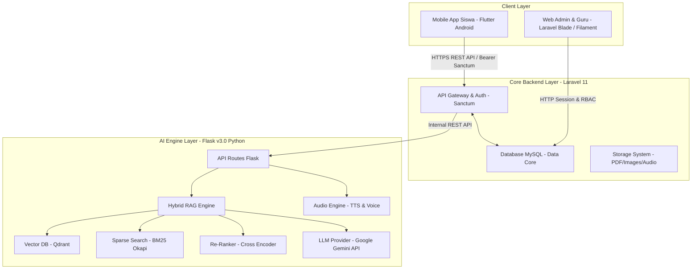

# DOKUMEN SPESIFIKASI TEKNIS SISTEM NETLABS
**Platform Media Pembelajaran & Pendamping Praktikum Jaringan Digital Berbasis Hybrid RAG AI**

---

## 1. DOKUMEN OVERVIEW

NetLabs adalah ekosistem media pembelajaran interaktif untuk siswa kejuruan jaringan komputer yang mengintegrasikan aplikasi *mobile* berbasis Android dengan *web back-office* untuk Administrator/Guru dan *engine* Kecerdasan Buatan (AI Tutor) berbasis *Hybrid Retrieval-Augmented Generation* (RAG).

### 1.1 Arsitektur Sistem (High-Level Architecture)



---

## 2. STACK TEKNOLOGI

| Komponen | Teknologi / Framework | Versi / Librari Utama | Fungsi Utama |
| :--- | :--- | :--- | :--- |
| **Mobile App** | Flutter (Dart) | Flutter v3.x, GetX / Provider | Antarmuka interaktif siswa (Android) |
| **Web Back-Office** | Laravel | Laravel 11.x, PHP 8.2+ | Panel kontrol guru/admin, manajemen materi, kuis, user |
| **Database Core** | MySQL / MariaDB | MySQL 8.0 / MariaDB 10.6+ | Penyimpanan data pengguna, kuis, materi, log aktivitas |
| **AI Backend Services**| Python | Flask 3.0, PyTorch | Server mikroservis layanan cerdas AI Tutor |
| **Vector Store** | Qdrant DB | Local Persisted Qdrant | Penyimpanan *dense embeddings* materi jaringan |
| **Sparse Indexing** | Rank-BM25 | BM25 Okapi | Pencarian kata kunci dan istilah teknis jaringan |
| **Embedding Model** | SentenceTransformers | `paraphrase-multilingual-MiniLM-L12-v2` | Pembentukan vektor *multilingual* |
| **Re-Ranking Model** | Cross-Encoder | `cross-encoder/ms-marco-MiniLM-L-6-v2` | *Re-ranking* relevansi dokumen hasil RAG |
| **Large Language Model**| Google Gemini API | `gemini-1.5-flash` / `pro` | Pembentuk jawaban kontekstual & edukatif |
| **Audio Processing** | gTTS & Speech Recognition| Python gTTS / Whisper | Fitur Text-to-Speech & Voice Input Chatbot |

---

## 3. SKEMA DATABASE & ENTITY RELATIONSHIP DIAGRAM (ERD)

### 3.1 Tabel Utama & Deskripsi Entitas

1. **`users`**
   - `id` (PK, BigInt Auto Increment)
   - `username` (Varchar, Unique, NIS Siswa / Username)
   - `name` (Varchar, Nama Lengkap)
   - `email` (Varchar, Unique, Email Siswa/Admin)
   - `password` (Varchar, Hashed bcrypt)
   - `role` (Enum: `'admin'`, `'guru'`, `'siswa'`)
   - `foto_profil` (Varchar, Nullable)
   - `remember_token`, `created_at`, `updated_at`

2. **`kelas`**
   - `id` (PK, BigInt)
   - `nama_kelas` (Varchar, contoh: "X TKJ 1")
   - `jurusan` (Varchar, contoh: "Teknik Komputer dan Jaringan")
   - `created_at`, `updated_at`

3. **`pertemuan`**
   - `id` (PK, BigInt)
   - `judul_pertemuan` (Varchar)
   - `urutan` (Integer)
   - `deskripsi` (Text)
   - `created_at`, `updated_at`

4. **`topik_materi`**
   - `id` (PK, BigInt)
   - `pertemuan_id` (FK -> `pertemuan.id`)
   - `judul_topik` (Varchar)
   - `konten_materi` (LongText, Format HTML/Markdown)
   - `file_pdf_path` (Varchar, Nullable)
   - `created_at`, `updated_at`

5. **`soal_kuis`**
   - `id` (PK, BigInt)
   - `pertemuan_id` (FK -> `pertemuan.id`)
   - `pertanyaan` (Text)
   - `opsi_a` (Text), `opsi_b` (Text), `opsi_c` (Text), `opsi_d` (Text)
   - `kunci_jawaban` (Enum: `'A'`, `'B'`, `'C'`, `'D'`)
   - `pembahasan` (Text, Nullable)

6. **`hasil_kuis`**
   - `id` (PK, BigInt)
   - `user_id` (FK -> `users.id`)
   - `pertemuan_id` (FK -> `pertemuan.id`)
   - `skor` (Decimal 5,2)
   - `jumlah_benar` (Integer), `jumlah_salah` (Integer)
   - `created_at`, `updated_at`

7. **`progress_siswa`**
   - `id` (PK, BigInt)
   - `user_id` (FK -> `users.id`)
   - `pertemuan_id` (FK -> `pertemuan.id`)
   - `status` (Enum: `'belum_selesai'`, `'selesai'`)
   - `updated_at`

8. **`chat_histories`**
   - `id` (PK, BigInt)
   - `siswa_id` (FK -> `users.id`)
   - `pertemuan_id` (FK -> `pertemuan.id`)
   - `sender` (Enum: `'siswa'`, `'ai'`)
   - `pesan` (Text)
   - `sumber_referensi` (Text, Nullable)
   - `created_at`

---

## 4. SPESIFIKASI API REST (LARAVEL SANCTUM)

### 4.1 Autentikasi API

Semua *endpoint* terproteksi wajib menyertakan HTTP Header:
```http
Authorization: Bearer <SANCTUM_TOKEN>
Accept: application/json
```

### 4.2 Daftar Endpoint API Utilitas

| Method | Endpoint | Fungsi | Status Access |
| :--- | :--- | :--- | :--- |
| `POST` | `/api/login` | Autentikasi NIS/Password & Generasi Token | Public |
| `POST` | `/api/register` | Registrasi Akun Siswa Baru | Public |
| `POST` | `/api/logout` | Revokasi Token Sanctum | Protected |
| `GET`  | `/api/user-profile` | Mengambil data akun siswa aktif | Protected |
| `GET`  | `/api/pertemuan` | Mengambil daftar materi per pertemuan | Protected |
| `GET`  | `/api/pertemuan/{id}` | Detail materi praktikum & modul PDF | Protected |
| `POST` | `/api/pertemuan/{id}/selesai` | Tandai pertemuan telah diselesaikan | Protected |
| `GET`  | `/api/pertemuan/{id}/kuis` | Mengambil soal kuis berdasarkan pertemuan | Protected |
| `POST` | `/api/kuis/submit` | Mengirimkan jawaban kuis & hitung skor | Protected |
| `GET`  | `/api/kuis/riwayat` | Mengambil riwayat capaian kuis siswa | Protected |
| `POST` | `/api/chat` | Mengirim pertanyaan teks ke AI Tutor | Protected |
| `POST` | `/api/chat/audio` | Mengirim pertanyaan suara/audio ke AI Tutor | Protected |
| `GET`  | `/api/siswa/statistik` | Mengambil data statistik & streak keaktifan | Protected |

---

## 5. SPESIFIKASI ALUR HYBRID RAG (PYTHON AI BACKEND)

```
[User Query] ──► [Bi-Encoder: Dense Embedding] ──► [Qdrant Vector DB] ──┐
             └──► [Sparse Tokenization]       ──► [BM25 Okapi]         ──┼─► [RRF Fusion] ──► [Cross-Encoder Re-rank] ──► [Gemini Prompt Synthesis] ──► [Response]
```

1. **Preprocessing**: Pembersihan teks, penanganan diakritik, dan penguraian istilah teknis jaringan.
2. **Dense Retrieval**: Menggunakan `paraphrase-multilingual-MiniLM-L12-v2` ke dalam Qdrant Vector Store untuk menangkap arti semantik.
3. **Sparse Retrieval**: Menggunakan BM25 Okapi untuk pencarian istilah persis (seperti command Cisco `show ip interface brief`, subnetting, jenis kabel UTP).
4. **Reciprocal Rank Fusion (RRF)**: Penggabungan urutan hasil *dense* dan *sparse* menggunakan konstanta *k* = 60.
5. **Cross-Encoder Re-Ranking**: Menggunakan `ms-marco-MiniLM-L-6-v2` untuk menyaring Top-N dokumen yang paling relevan.
6. **LLM Generation**: Google Gemini menyintesis jawaban yang terstruktur, edukatif, dan ramah sesuai konteks praktikum jaringan.

---

## 6. PENJELASAN KODE & FUNGSI-FUNGSI PENTING SISTEM

Berikut adalah dokumentasi teknis mendalam mengenai implementasi fungsi-fungsi vital (*core functions*) yang mendorong kerja sistem NetLabs pada Backend Web Laravel, Backend AI Python, dan Integrasi Mobile.

### 6.1 Autentikasi Kredensial & Generasi Token (Laravel Sanctum)
- **Lokasi Berkas**: `backend-web/app/Http/Controllers/Api/AuthController.php`
- **Nama Fungsi**: `login(LoginRequest $request)`

```php
public function login(LoginRequest $request)
{
    try {
        // 1. Cari user berdasarkan Username / NIS
        $user = User::where('username', $request->username)->first();

        // 2. Validasi keberadaan user dan verifikasi kata sandi bcrypt
        if (!$user || !Hash::check($request->password, $user->password)) {
            return response()->json([
                'message' => 'Nomor Induk (NIS) atau Kata Sandi salah.'
            ], 401);
        }

        // 3. Validasi status keaktifan akun
        if ($user->status === 'nonaktif') {
            return response()->json([
                'message' => 'Akun Anda telah dinonaktifkan oleh administrator.'
            ], 403);
        }

        // 4. Mencegah Multi-Device / Single Active Session (Revokasi token lama)
        $user->tokens()->delete();

        // 5. Generasi Plain Text Token Laravel Sanctum baru
        $token = $user->createToken('netlabs_token')->plainTextToken;

        return response()->json([
            'message' => 'Login Berhasil!',
            'user' => new UserResource($user),
            'token' => $token
        ], 200);
    } catch (Exception $e) {
        Log::error('Error saat login user: ' . $e->getMessage());
        return response()->json(['message' => 'Terjadi kesalahan pada server.'], 500);
    }
}
```

**Penjelasan Alur & Logika Kode:**
1. **Pencarian Entitas Siswa**: Menggunakan Query Builder `User::where('username', ...)->first()` untuk mengambil data siswa berdasarkan NIS.
2. **Kriptografi Hash Verification**: `Hash::check()` membandingkan kata sandi *plain text* dari input siswa dengan nilai *hash* Bcrypt terenkripsi di database MySQL tanpa mendeskripsikan hash asli.
3. **Single Active Session Security**: `$user->tokens()->delete()` mencabut seluruh Personal Access Token terdahulu sebelum menerbitkan token baru. Hal ini mencegah penggunaan akun siswa secara bersamaan (*account sharing*) pada multiple perangkat.
4. **Token Generation**: `$user->createToken('netlabs_token')->plainTextToken` menghasilkan token bearer acak yang aman untuk dikirimkan ke aplikasi Flutter Android.

---

### 6.2 Layanan Komunikasi Inter-Service ke Engine AI (`ChatService.php`)
- **Lokasi Berkas**: `backend-web/app/Services/ChatService.php`
- **Nama Fungsi**: `kirimPesanTeks($siswa, ?int $pertemuanId, string $pesan)`

```php
public function kirimPesanTeks($siswa, ?int $pertemuanId, string $pesan): array
{
    // 1. Catat riwayat pertanyaan siswa ke Database Laravel
    ChatHistory::create([
        'siswa_id' => $siswa->id,
        'pertemuan_id' => $pertemuanId,
        'sender' => 'siswa',
        'pesan' => $pesan,
    ]);

    $balasan = 'Maaf, terjadi kesalahan saat menghubungi AI Tutor.';
    $sumber = 'Netlabs AI Tutor';

    try {
        // 2. HTTP POST Request ke Python Flask AI Microservice
        $response = Http::timeout(60)->post("{$this->aiUrl}/chat", [
            'pertemuan_id' => $pertemuanId,
            'message' => $pesan,
        ]);

        if ($response->successful()) {
            $balasan = $response->json('answer') ?? $balasan;
            $sources = $response->json('sources') ?? [];
            if (!empty($sources)) {
                $sumber = implode(', ', $sources);
            }
        }
    } catch (Exception $e) {
        Log::error('AI Chat Error: ' . $e->getMessage());
    }

    // 3. Simpan balasan AI ke database
    $chatAi = ChatHistory::create([
        'siswa_id' => $siswa->id,
        'pertemuan_id' => $pertemuanId,
        'sender' => 'ai',
        'pesan' => $balasan,
        'sumber_referensi' => $sumber,
    ]);

    return [
        'sender' => 'ai',
        'pesan' => $balasan,
        'sumber' => $sumber,
        'waktu' => $chatAi->created_at->format('Y-m-d H:i'),
    ];
}
```

**Penjelasan Alur & Logika Kode:**
1. **Auditing & State Persistence**: Menyimpan pesan siswa ke tabel `chat_histories` terlebih dahulu sebelum memanggil API eksternal guna mengantisipasi kegagalan jaringan.
2. **HTTP Guzzle Client Connection**: `Http::timeout(60)->post(...)` bertindak sebagai API Client yang menghubungkan Laravel Core dengan Python Flask AI Engine di port 5050.
3. **Data Extraction & Citations**: Ekstraksi balasan AI (`answer`) serta sumber dokumen rujukan (`sources`) yang kemudian disimpan kembali ke MySQL untuk kebutuhan audit log oleh Guru.

---

### 6.3 Algoritma Penggabungan Pencarian (Reciprocal Rank Fusion / RRF)
- **Lokasi Berkas**: `backend-ai/services/hybrid_search_service.py`
- **Nama Fungsi**: `_reciprocal_rank_fusion(dense_results, sparse_results, k=60)`

```python
def _reciprocal_rank_fusion(
    dense_results: list[dict],
    sparse_results: list[dict],
    k: int = 60,
) -> list[dict]:
    """Menggabungkan hasil Dense Retrieval (Qdrant) dan Sparse Retrieval (BM25)

    Rumus RRF: Score(d) = Σ 1 / (k + rank(d))
    """
    rrf_scores: dict[tuple, dict] = {}

    # 1. Proses Peringkat Hasil Dense Retrieval (Vector Similarity)
    for rank, doc in enumerate(dense_results, start=1):
        doc_key = (doc["source_file"], doc["chunk_index"])
        if doc_key not in rrf_scores:
            rrf_scores[doc_key] = {
                "teks_asli": doc["teks_asli"],
                "source_file": doc["source_file"],
                "chunk_index": doc["chunk_index"],
                "rrf_score": 0.0,
            }
        rrf_scores[doc_key]["rrf_score"] += 1.0 / (k + rank)

    # 2. Proses Peringkat Hasil Sparse Retrieval (BM25 Keywords)
    for rank, doc in enumerate(sparse_results, start=1):
        doc_key = (doc["source_file"], doc["chunk_index"])
        if doc_key not in rrf_scores:
            rrf_scores[doc_key] = {
                "teks_asli": doc["teks_asli"],
                "source_file": doc["source_file"],
                "chunk_index": doc["chunk_index"],
                "rrf_score": 0.0,
            }
        rrf_scores[doc_key]["rrf_score"] += 1.0 / (k + rank)

    # 3. Urutkan dokumen berdasarkan skor RRF tertinggi
    fused = sorted(rrf_scores.values(), key=lambda x: x["rrf_score"], reverse=True)
    return fused
```

**Penjelasan Alur & Matematika Algoritma:**
1. **Masalah yang Diatasi**: Pencarian berbasis Vektor (*Dense Retrieval*) unggul memahami makna semantik umum, namun sering gagal menemukan perintah spesifik (seperti `show ip route` atau istilah kabel UTP). Sebaliknya, *BM25 Sparse Search* unggul pada istilah persis (*exact keywords*).
2. **Invariansi Skala Skor**: Karena skor Cosine Similarity Qdrant dan skor BM25 memiliki rentang skala berbeda (misal 0.0–1.0 vs 0.0–25.5), RRF **tidak memperdulikan nilai skor mentah**, melainkan hanya menggunakan **posisi peringkat (*rank*)** dokumen.
3. **Rumus RRF**: Dengan konstanta *smoothing* *k* = 60 (Cormack et al., 2009), dokumen yang berada di peringkat 1 pada kedua metode akan menerima akumulasi nilai RRF terbesar:
   $$\text{Score}_{\text{RRF}}(d) = \frac{1}{60 + 1} + \frac{1}{60 + 1} = \frac{2}{61} \approx 0.03278$$
4. **Penyaringan kandidat**: Hasil *fusion* diurutkan secara *descending* untuk diserahkan ke tahap *Cross-Encoder Re-Ranking*.

---

### 6.4 Sintesis Jawaban Terkonteks & Proteksi Halusinasi AI (`api_routes.py`)
- **Lokasi Berkas**: `backend-ai/routes/api_routes.py`
- **Struktur Kode & Prompt**:

```python
SYSTEM_PROMPT = """Kamu adalah NetLabs AI Tutor, asisten cerdas untuk pembelajaran Jaringan Komputer di tingkat SMK.

ATURAN KETAT:
1. Jawab pertanyaan siswa HANYA berdasarkan konteks dokumen praktikum jaringan komputer yang disediakan di bawah.
2. JANGAN pernah berhalusinasi atau menggunakan pengetahuan bawaan/umum di luar konteks materi modul resmi.
3. Jika informasi yang ditanyakan tidak tercantum secara eksplisit dalam konteks dokumen, Anda harus menolak menjawab.
4. Gunakan bahasa Indonesia yang formal, jelas, dan mudah dipahami oleh siswa SMK.

KONTEKS DOKUMEN MODUL RESMI:
---
{konteks}
---

Berdasarkan HANYA konteks dokumen di atas, jawab pertanyaan siswa berikut dengan lengkap dan akurat."""
```

**Penjelasan Logika & Proteksi Sistem:**
1. **Grounded Generation**: Menyuntikkan pecahan teks materi (*chunks*) hasil pencarian RAG ke dalam variabel `{konteks}` sebelum dikirimkan ke model Google Gemini.
2. **Anti-Hallucination Constraints**: Aturan sistem nomor 1–3 memaksa AI bertindak sebagai *closed-domain QA system*. Apabila siswa menanyakan topik di luar modul (seperti resep makanan atau pemrograman web), AI secara otomatis menolak memberikan jawaban yang tidak bersumber dari modul resmi.

---

## 7. CARA DEPLOYMENT & INSTRUKSI SETUP LINGKUNGAN

### 7.1 Setup Backend Web (Laravel 11)
```bash
cd backend-web
composer install
cp .env.example .env
php artisan key:generate
# Sesuaikan DB_DATABASE, DB_USERNAME, DB_PASSWORD di .env
php artisan migrate --seed
php artisan storage:link
php artisan serve --port=8000
```

### 7.2 Setup Backend AI Engine (Python Flask)
```bash
cd backend-ai
python -m venv venv
# Windows:
.\venv\Scripts\activate
pip install -r requirements.txt
python app.py
# Server berjalan di http://localhost:5000
```

### 7.3 Setup Mobile Application (Flutter)
```bash
cd netlabs_mobile
flutter pub get
# Sesuaikan baseUrl API di lib/app/config/api_config.dart
flutter run
```
